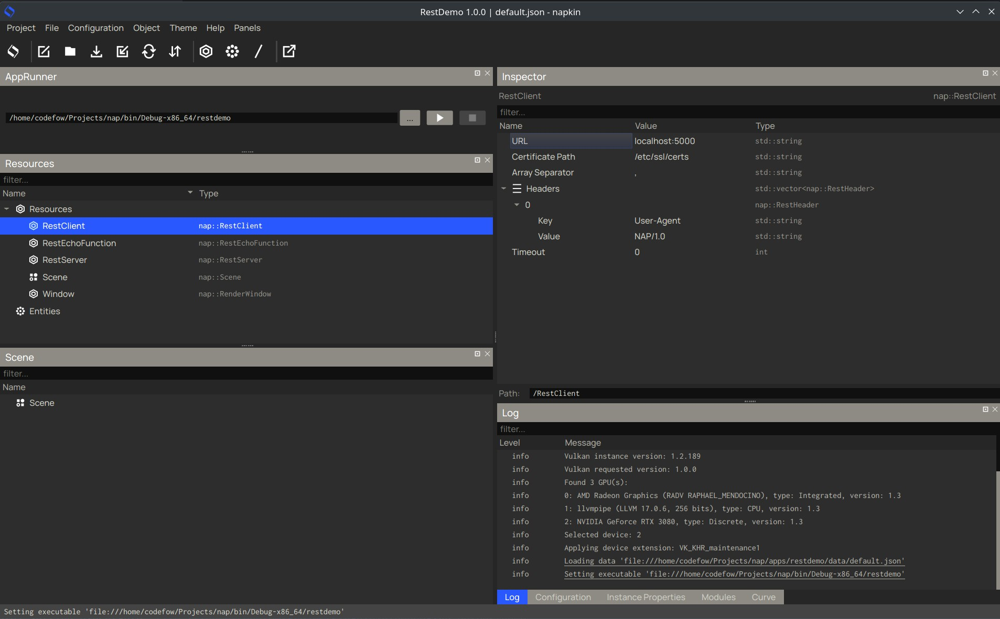

# NAP REST
Easily serve a Rest API from your NAP application or perform API calls from your NAP applications. Depends on the single header [cpp-httplib](https://github.com/yhirose/cpp-httplib) 

## Use the NAP rest module as a server
Add a RestServer device to your resources. You can create & add RestFunctions to the server that correspond to API calls to the address & port as set in the RestServer.


For each API call that you want your application to handle, create a function that extends on `RestFunction`. You can look at the `RestEchoFunction` class for an example. 

Extend on the `RestFunction` class and override the `call` function. This function will be called when the API call is made. The `call` returns a `RestResponse` object containing the data that you want to serve.

Note that calls to the `call` method are made from a server worker thread. 

```cpp
/**
 * The function to call when the rest call is made
 * Note: this function is called from a server worker thread
 * @param values reference to values map
 * @return RestResponse the response to the call, will be sent back to the client
 */
virtual RestResponse call(const RestValueMap& values) = 0;
```

Example of how to create your RestFunction // API call in Napkin :


## Use the NAP rest module as a client

You can also use the NAP rest module to make API calls from your NAP application. Just create a RestClient device and call the `get` method.

You can choose to make a blocking call or a non-blocking call. Both the non-blocking and blocking call will execute the callbacks on the main thread during the update loop of the RestService.

```cpp
/**
 * Sends a get request, non-blocking, callbacks are executed on the main thread during the update loop of RestService
 * @param address the address to send the request to
 * @param params the parameters to send with the request
 * @param onSuccess on success callback
 * @param onError on error callback
 */
void get(const std::string& address,
         const std::vector<std::unique_ptr<APIBaseValue>>& params,
         std::function<void(const RestResponse& response)> onSuccess,
         std::function<void(const utility::ErrorState&)> onError);

/**
 * Sends a blocking get request
 * @param address the address to send the request to
 * @param params the parameters to send with the request
 * @param response response object to fill with the response
 * @param errorState contains the error state
 * @return true on success
 */
bool getBlocking(const std::string& address,
                 const std::vector<std::unique_ptr<APIBaseValue>>& params,
                 RestResponse& response,
                 utility::ErrorState& errorState);
```

You can then simply add the RestClient device as a resource to you application.

